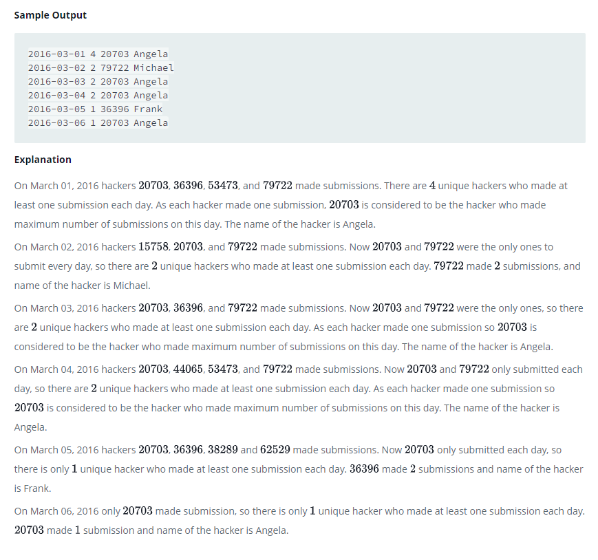

### 15 Days of Learning SQL




#### Topic:
Julia conducted a days of learning SQL contest. The start date of the contest was March 01, 2016 and the end date was March 15, 2016.
Write a query to print total number of unique hackers who made at least submission each day (starting on the first day of the contest), and find the hacker_id and name of the hacker who made maximum number of submissions each day. If more than one such hacker has a maximum number of submissions, print the lowest hacker_id. The query should print this information for each day of the contest, sorted by the date.
Sample Output

2016-03-01 4 20703 Angela
2016-03-02 2 79722 Michael
2016-03-03 2 20703 Angela
2016-03-04 2 20703 Angela
2016-03-05 1 36396 Frank
2016-03-06 1 20703 Angela


#### Language : MS SQL
```sql
with MaxSubEachDay as (
    select submission_date,
           hacker_id,
           RANK() OVER(partition by submission_date order by SubCount desc, hacker_id) as Rn
    FROM
    (select submission_date, hacker_id, count(1) as SubCount 
     from submissions
     group by submission_date, hacker_id
     ) subQuery
), DayWiseRank as (
    select submission_date,
           hacker_id,
           DENSE_RANK() OVER(order by submission_date) as dayRn
    from submissions
), HackerCntTillDate as (
select outtr.submission_date,
       outtr.hacker_id,
       case when outtr.submission_date='2016-03-01' then 1
            else 1+(select count(distinct a.submission_date)                         from submissions a where a.hacker_id = outtr.hacker_id and                              a.submission_date<outtr.submission_date)
        end as PrevCnt,
        outtr.dayRn
from DayWiseRank outtr
), HackerSubEachDay as (
    select submission_date,
    count(distinct hacker_id) HackerCnt
from HackerCntTillDate
  where PrevCnt = dayRn
group by submission_date
)
select HackerSubEachDay.submission_date,
       HackerSubEachDay.HackerCnt,
       MaxSubEachDay.hacker_id,
       Hackers.name
from HackerSubEachDay
inner join MaxSubEachDay
 on HackerSubEachDay.submission_date = MaxSubEachDay.submission_date
inner join Hackers
 on Hackers.hacker_id = MaxSubEachDay.hacker_id
where MaxSubEachDay.Rn=1
```
