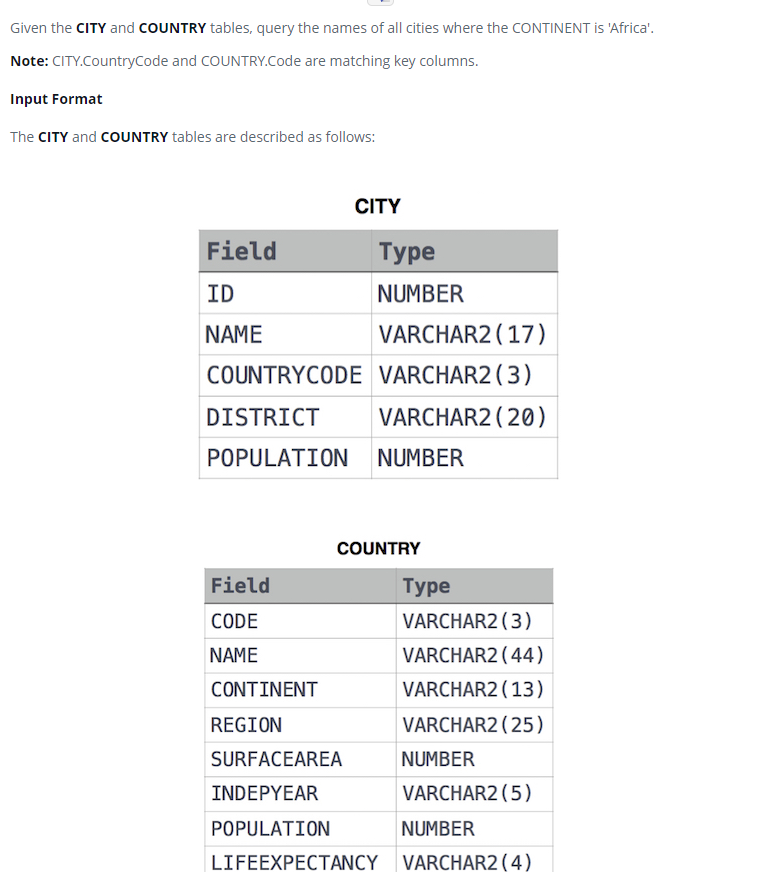

### African Cities 




#### Topic:
Given the CITY and COUNTRY tables, query the names of all cities where the CONTINENT is 'Africa'.

Note: CITY.CountryCode and COUNTRY.Code are matching key columns.


#### Language : MS SQL
```sql
select CY.NAME from CITY CY inner join
COUNTRY CO on CY.COUNTRYCODE = CO.CODE 
where CO.CONTINENT = 'africa'
```
