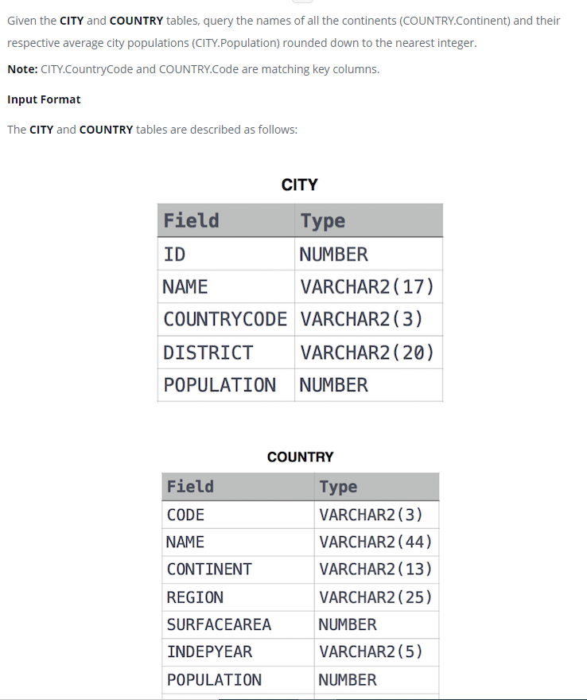

### Average Population of Each Continent




#### Topic:
Given the CITY and COUNTRY tables, query the names of all the continents (COUNTRY.Continent) and their respective average city populations (CITY.Population) rounded down to the nearest integer.

Note: CITY.CountryCode and COUNTRY.Code are matching key columns.


#### Language : MS SQL
```sql
select CO.CONTINENT , floor(avg(CY.POPULATION)) from CITY CY inner join
COUNTRY CO on CO.CODE = CY.COUNTRYCODE 
GROUP By CO.CONTINENT
```
