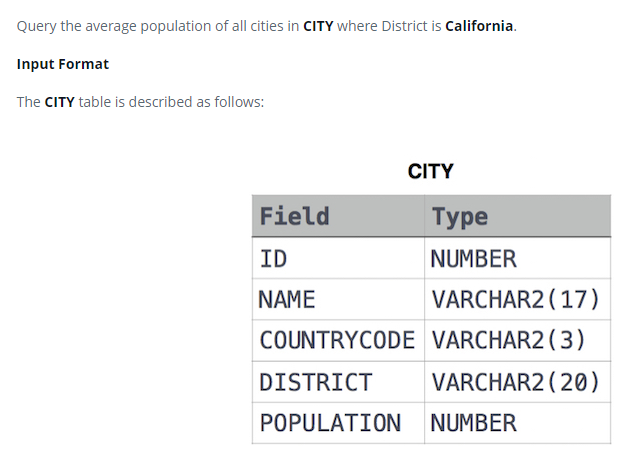

### Average Population 




#### Topic:
Query the average population for all cities in CITY, rounded down to the nearest integer.


#### Language : MS SQL
```sql
select round (avg(POPULATION),-1) from CITY
```
