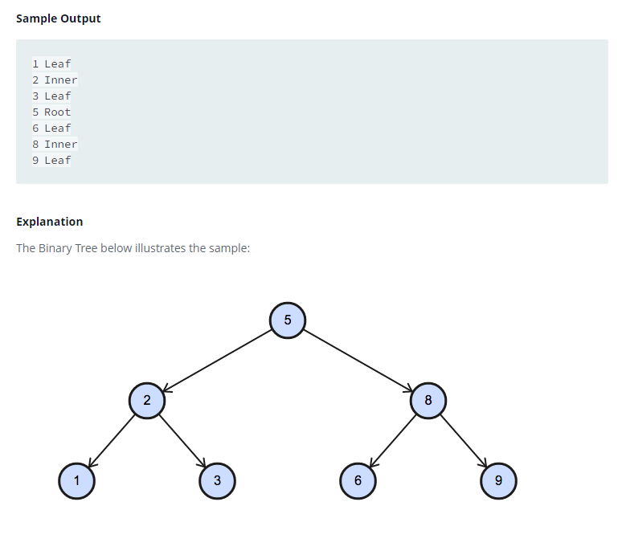

### Binary Tree Nodes




#### Topic:
You are given a table, BST, containing two columns: N and P, where N represents the value of a node in Binary Tree, and P is the parent of N.
Write a query to find the node type of Binary Tree ordered by the value of the node. Output one of the following for each node:

*Root: If node is root node.
*Leaf: If node is leaf node.
*Inner: If node is neither root nor leaf node.
Sample Output

1 Leaf
2 Inner
3 Leaf
5 Root
6 Leaf
8 Inner
9 Leaf


#### Language : MS SQL
```sql
select b.N,
     ( case when b.P is  null
            then 'Root'
            when (select count(*)  from BST b2 where b2.P =b.N) > 0
            then 'Inner'
            Else 'Leaf'
      end)

from BST b 
order by N
;
```
