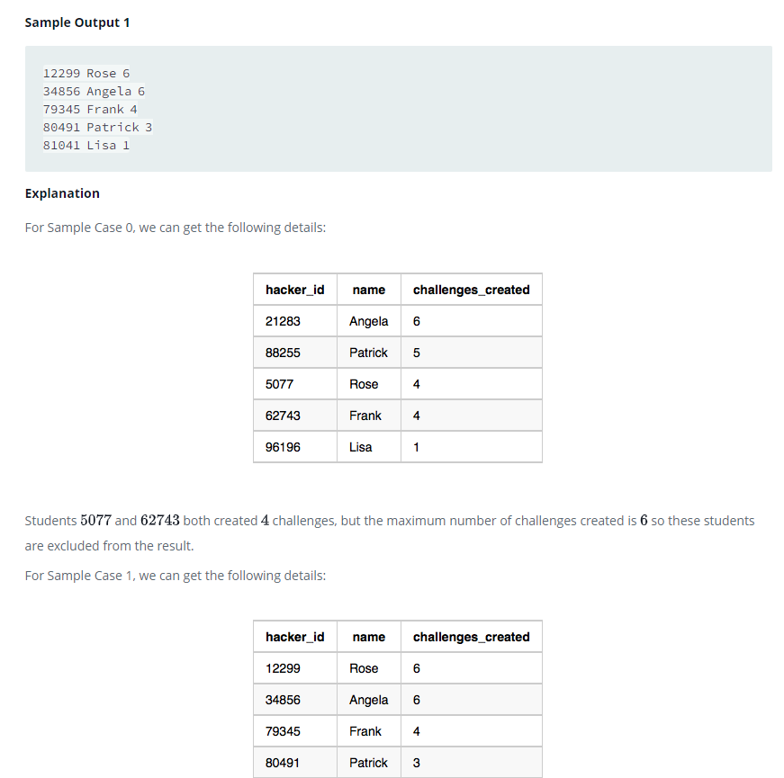

### Challenges




#### Topic:
Julia asked her students to create some coding challenges. Write a query to print the hacker_id, name, and the total number of challenges created by each student. Sort your results by the total number of challenges in descending order. If more than one student created the same number of challenges, then sort the result by hacker_id. If more than one student created the same number of challenges and the count is less than the maximum number of challenges created, then exclude those students from the result.


#### Language : MS SQL
```sql
with Number_challenge as (
select
ROW_NUMBER() over (partition by hacker_id order by hacker_id) as rn,
hacker_id,
count(challenge_id) as challenge_count
from Challenges
group by hacker_id
),
valid as (
select Nc.challenge_count as chcount,Nc.hacker_id as hid,
case
   when Nc.challenge_count = (select max(challenge_count) from Number_challenge) 
   then 'Valid'
   else 'Invalid'
end as checking  
from Number_challenge Nc
),
results as (
select  *
from valid 
where valid.checking ='Invalid'
and valid.chcount not in (select valid.chcount from valid group by valid.chcount having count(valid.chcount) > 1)
union 
select  *
from valid 
where valid.checking ='valid'
)
select  r.hid,name,r.chcount
from results r join Hackers h on h.hacker_id = r.hid
ORDER BY r.chcount DESC;

```
