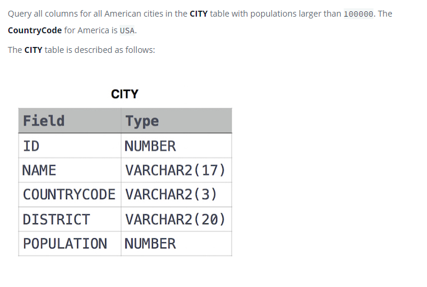

### Contest Leaderboard




#### Topic:
You did such a great job helping Julia with her last coding contest challenge that she wants you to work on this one, too!

The total score of a hacker is the sum of their maximum scores for all of the challenges. Write a query to print the hacker_id, name, and total score of the hackers ordered by the descending score. If more than one hacker achieved the same total score, then sort the result by ascending hacker_id. Exclude all hackers with a total score of 0 from your result.
Sample Output

4071 Rose 191
74842 Lisa 174
84072 Bonnie 100
4806 Angela 89
26071 Frank 85
80305 Kimberly 67
49438 Patrick 43


#### Language : MS SQL
```sql
with total_score as (
select submission_id,
    hacker_id,
    challenge_id,
    score,
    RANK() OVER(ORDER BY challenge_id asc, hacker_id asc) Rank
from Submissions
),
maximum_score as(
select t.hacker_id as hackerid,max(t.score) as max_score from total_score t
group by t.rank,t.hacker_id,t.challenge_id
),
calculate_score_hacker as(
select ms.hackerid as hackerID,sum(ms.max_score) as scoref from maximum_score ms
group by ms.hackerid
)
select csh.hackerID,name,csh.scoref from calculate_score_hacker csh inner join Hackers H
on csh.hackerID = H.hacker_id
where csh.scoref <> 0
order by csh.scoref desc ,csh.hackerID

```
