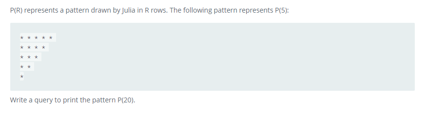

### Draw The Triangle 1




#### Topic:
P(R) represents a pattern drawn by Julia in R rows. The following pattern represents P(5):

* * * * * 
* * * * 
* * * 
* * 
*
Write a query to print the pattern P(20).


#### Language : MS SQL
```sql
WITH Pattern(Rows,Stars) AS (
SELECT 1, 20 UNION ALL
SELECT Rows + 1, Stars - 1
FROM Pattern
WHERE Rows < 20
)
SELECT REPLICATE('* ',Stars)
FROM Pattern
ORDER BY Rows asc;
```
