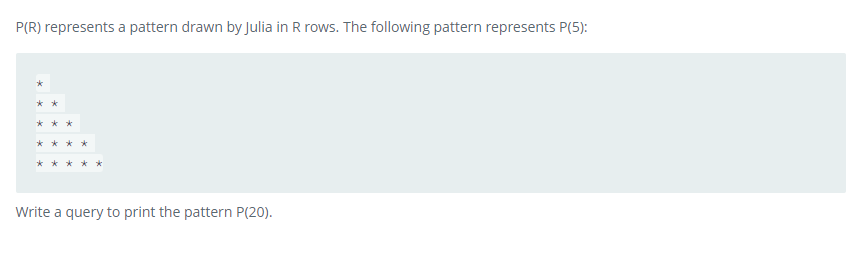

### Draw The Triangle 2




#### Topic:
P(R) represents a pattern drawn by Julia in R rows. The following pattern represents P(5):

* 
* * 
* * * 
* * * * 
* * * * *
Write a query to print the pattern P(20).


#### Language : MS SQL
```sql
with pattern(rows, star) AS(
select 1,20 union all
select rows + 1 , star - 1
from pattern where rows < 20
)
SELECT REPLICATE('* ',star)
FROM Pattern
ORDER BY Rows DESC;
```
