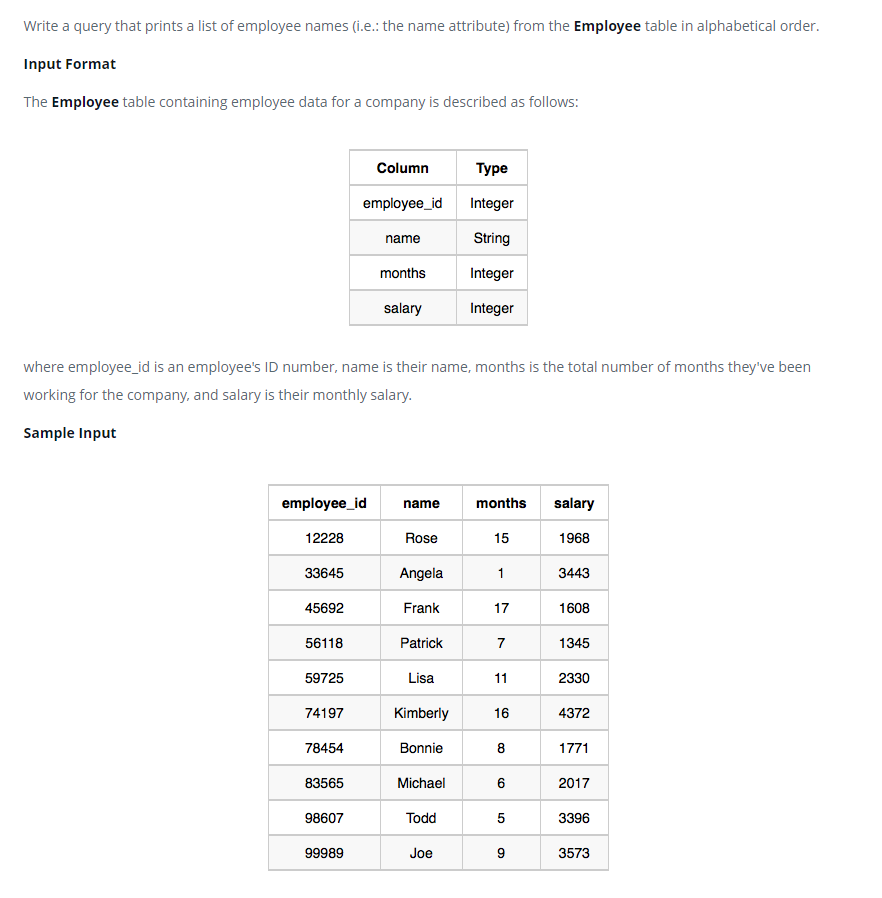

### Employee Names




#### Topic:
Write a query that prints a list of employee names (i.e.: the name attribute) from the Employee table in alphabetical order.
where employee_id is an employee's ID number, name is their name, months is the total number of months they've been working for the company, and salary is their monthly salary.
Sample Output:
Angela 
Bonnie 
Frank 
Joe 
Kimberly 
Lisa 
Michael
Patrick
Rose
Todd


#### Language : MS SQL
```sql
select name from Employee 
order by name
```
