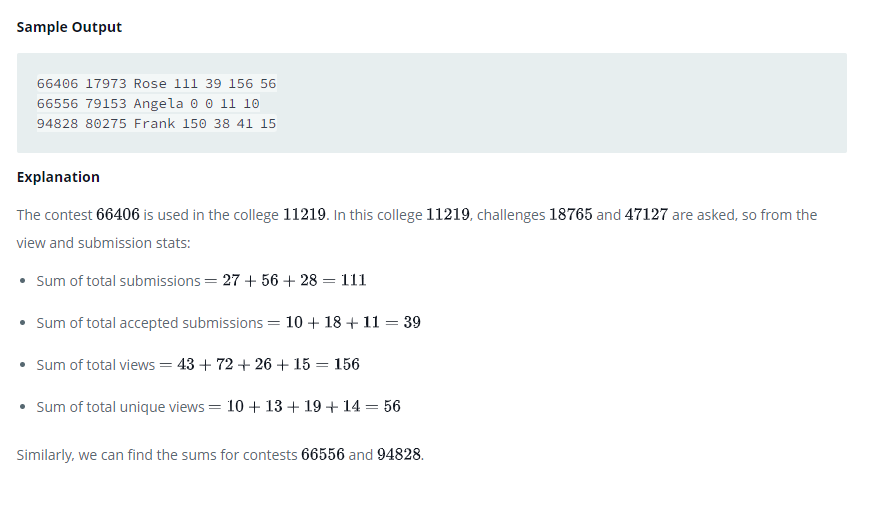

### Interviews




#### Topic:
Samantha interviews many candidates from different colleges using coding challenges and contests. Write a query to print the contest_id, hacker_id , name, and the sums of total_submissions, total_accepted_submissions, total_views , and total_unique_views for each contest sorted by contest_id. Exclude the contest from the result if all four sums are 0.

Note: A specific contest can be used to screen candidates at more than one college, but each college only holds screening contest.

Sample Output:
66406 17973 Rose 111 39 156 56
66556 79153 Angela 0 0 11 10
94828 80275 Frank 150 38 41 15


Explanation:

The contest 66406 is used in the college 11219. In this college 11219, challenges 18765 and 47127 are asked, so from the view and submission stats:
Sum of total submissions = 27 + 56 + 28 = 111
Sum of total accepted submissions = 10 + 18 + 11 = 39
Sum of total views = 43 + 72 + 26 + 15 = 156
Sum of total unique views = 10 + 13 + 19 + 14 = 56
Similarly, we can find the sums for contests 66556 and 94828.


#### Language : MS SQL
```sql
WITH Sub_stats_cte as
(
select challenge_id, SUM(total_Submissions) as total_submissions, SUM(total_accepted_Submissions) as total_accepted_submissions 
from Submission_Stats group by challenge_id 
), View_stats_cte as
(
select challenge_id, SUM(total_views) as total_views, SUM(total_unique_views) as total_unique_views 
from View_Stats group by challenge_id 
)
SELECT con.contest_id, con.hacker_id, con.name, ISNULL(SUM(total_submissions),0) total_submissions, 
ISNULL(SUM(total_accepted_submissions),0) total_accepted_submissions,
ISNULL(SUM(total_views),0) total_views, ISNULL(SUM(total_unique_views),0) total_unique_views
FROM Contests con
inner join Colleges col on con.contest_id = col.contest_id
inner join Challenges ch on col.college_id = ch.college_id
LEFT JOIN Sub_stats_cte c1 ON ch.challenge_id = c1.challenge_id 
LEFT JOIN View_stats_cte c2 ON ch.challenge_id = c2.challenge_id
GROUP BY con.contest_id, con.hacker_id, con.name
HAVING SUM(total_submissions)>0
OR SUM(total_accepted_submissions)>0
OR SUM(total_views)>0
OR SUM(total_unique_views)>0
ORDER BY contest_id;
```
