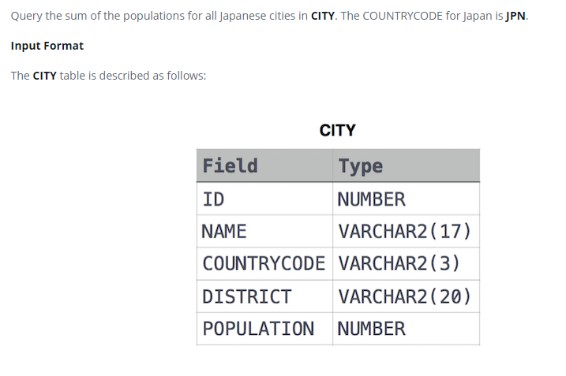

### Japan Population 




#### Topic:
Query the sum of the populations for all Japanese cities in CITY. The COUNTRYCODE for Japan is JPN.


#### Language : MS SQL
```sql
select SUM(POPULATION) from CITY where COUNTRYCODE ='JPN'
```
