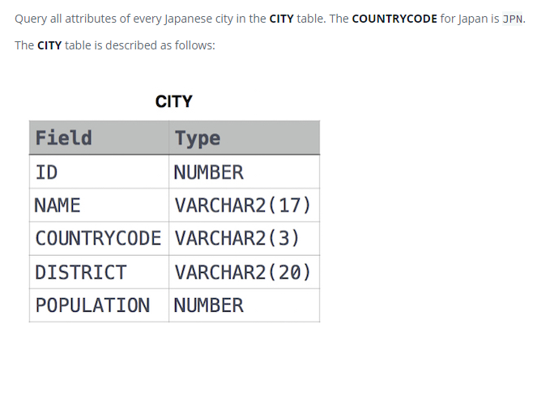

### Japanese Cities' Attributes




#### Topic:
Query all attributes of every Japanese city in the CITY table. The COUNTRYCODE for Japan is JPN.


#### Language : MS SQL
```sql
select * from CITY c where c.COUNTRYCODE = 'JPN'
```
