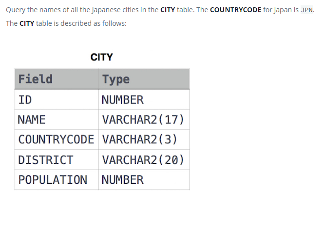

### Japanese Cities' Names




#### Topic:
Query the names of all the Japanese cities in the CITY table. The COUNTRYCODE for Japan is JPN.


#### Language : MS SQL
```sql
select NAME from CITY c where c.COUNTRYCODE = 'JPN'
```
