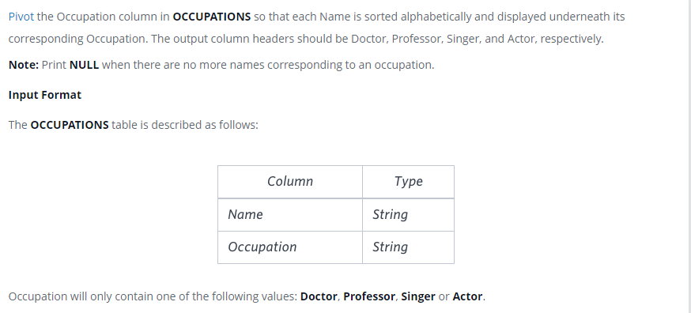

### Occupations




#### Topic:
Pivot the Occupation column in OCCUPATIONS so that each Name is sorted alphabetically and displayed underneath its corresponding Occupation. The output column headers should be Doctor, Professor, Singer, and Actor, respectively.

Note: Print NULL when there are no more names corresponding to an occupation.
Occupation will only contain one of the following values: Doctor, Professor, Singer or Actor.
Sample Output

Jenny    Ashley     Meera  Jane
Samantha Christeen  Priya  Julia
NULL     Ketty      NULL   Maria
Explanation

The first column is an alphabetically ordered list of Doctor names.
The second column is an alphabetically ordered list of Professor names.
The third column is an alphabetically ordered list of Singer names.
The fourth column is an alphabetically ordered list of Actor names.
The empty cell data for columns with less than the maximum number of names per occupation (in this case, the Professor and Actor columns) are filled with NULL values.


#### Language : MS SQL
```sql
with cte as
(
  select rank() over (partition by occupation order by name) as rnk,
  case when occupation = 'Doctor' then name else null end as Doctor,
  case when occupation = 'Professor' then name else null end as Professor,
  case when occupation = 'Singer' then name else null end as Singer,
  case when occupation = 'Actor' then name else null end as Actor
  from occupations
)
select min(Doctor), min(Professor), min(Singer), min(Actor)
from cte
group by rnk
;
```
