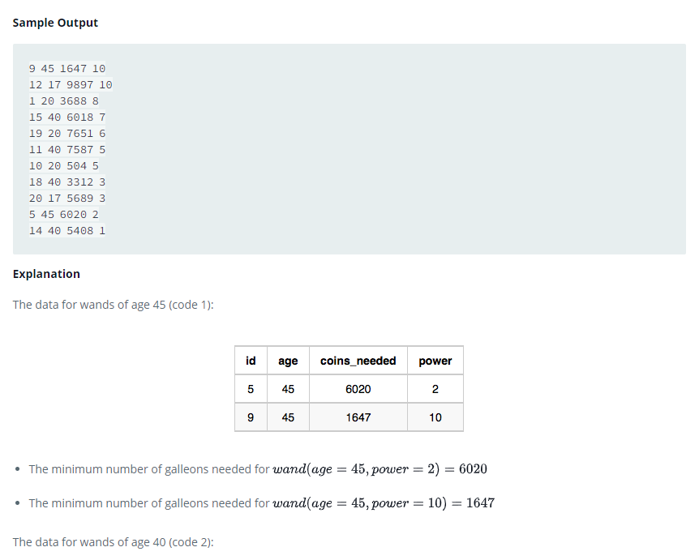

### Ollivander's Inventory




#### Topic:
Harry Potter and his friends are at Ollivander's with Ron, finally replacing Charlie's old broken wand.

Hermione decides the best way to choose is by determining the minimum number of gold galleons needed to buy each non-evil wand of high power and age. Write a query to print the id, age, coins_needed, and power of the wands that Ron's interested in, sorted in order of descending power . If more than one wand has same power, sort the result in order of descending age.
Sample Output:
9 45 1647 10
12 17 9897 10
1 20 3688 8
15 40 6018 7
19 20 7651 6
11 40 7587 5
10 20 504 5
18 40 3312 3
20 17 5689 3
5 45 6020 2
14 40 5408 1


#### Language : MS SQL
```sql
WITH Min_coins_needed_Max_Power as (
SELECT id,code,coins_needed , power,
ROW_NUMBER() over (partition by code , power order by code,power,coins_needed asc) as rn
from Wands
)
select M.id,age,M.coins_needed,M.power from Wands_Property P inner join Min_coins_needed_Max_Power M on P.code = M.code where P.is_evil = 0 and rn = 1 Order by M.power desc,age desc
```
