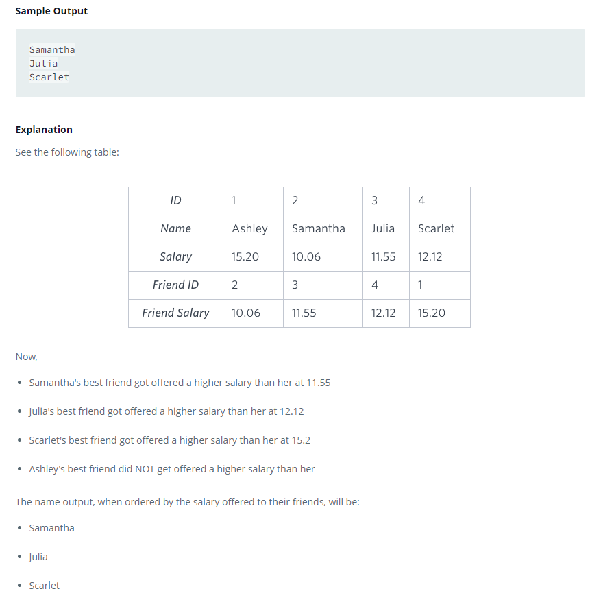

### Placements 




#### Topic:
You are given three tables: Students, Friends and Packages. Students contains two columns: ID and Name. Friends contains two columns: ID and Friend_ID (ID of the ONLY best friend). Packages contains two columns: ID and Salary (offered salary in $ thousands per month).

Write a query to output the names of those students whose best friends got offered a higher salary than them. Names must be ordered by the salary amount offered to the best friends. It is guaranteed that no two students got same salary offer.
Sample Output

Samantha
Julia
Scarlet
Now,

*Samantha's best friend got offered a higher salary than her at 11.55
*Julia's best friend got offered a higher salary than her at 12.12
*Scarlet's best friend got offered a higher salary than her at 15.2
*Ashley's best friend did NOT get offered a higher salary than her
*The name output, when ordered by the salary offered to their friends, will be:

Samantha
Julia
Scarlet


#### Language : MS SQL
```sql


with friend_salary as (
select Friend_ID, Salary
from Friends F 
     inner join Packages P on P.ID = F.Friend_ID
),

Solution_with_NULLS as (
select case  when FS.Salary > P.Salary then S.Name
       END as Name_Salary,
       FS.Salary
from Students S     
       inner JOIN Friends F ON F.ID = S.ID 
       inner JOIN Packages P ON P.ID = S.ID 
       inner join friend_salary FS on FS.Friend_ID =F.Friend_ID

)
SELECT Name_Salary
FROM Solution_with_NULLS
where Name_Salary is not null
order by Salary
```
