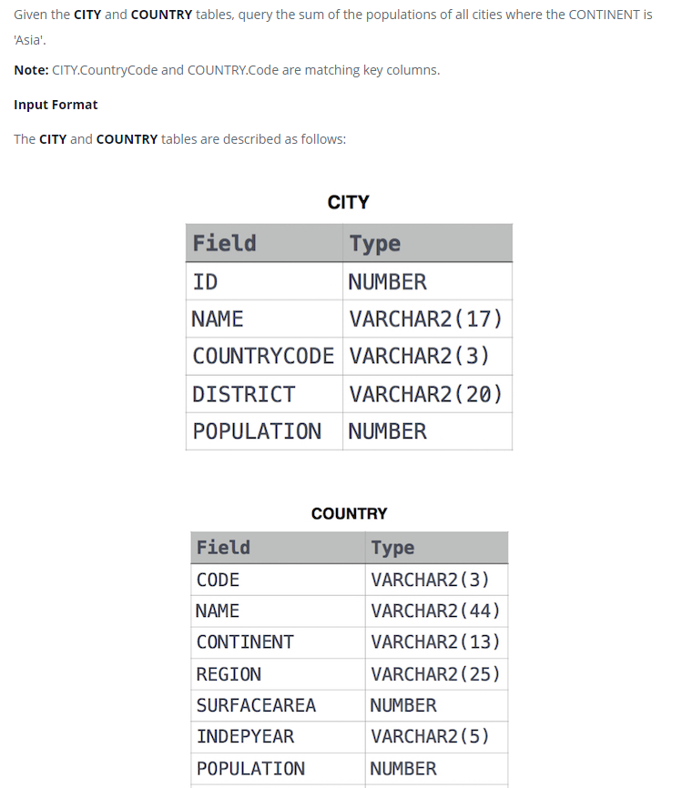

### Population Census




#### Topic:
Given the CITY and COUNTRY tables, query the sum of the populations of all cities where the CONTINENT is 'Asia'.

Note: CITY.CountryCode and COUNTRY.Code are matching key columns.


#### Language : MS SQL
```sql
select sum(CY.POPULATION) from COUNTRY CO inner join
CITY CY on CY.COUNTRYCODE = CO.CODE 
where CO.CONTINENT = 'Asia'
```
