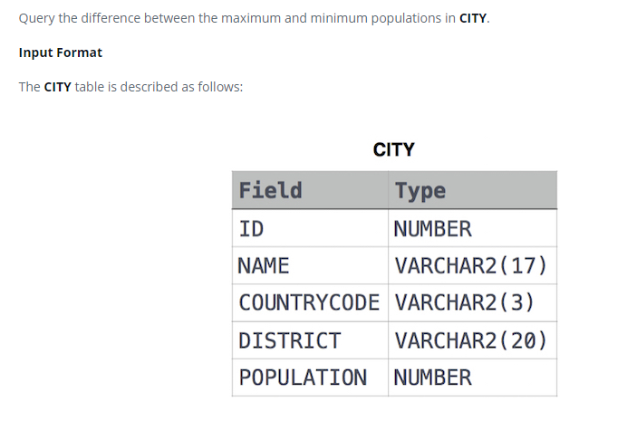

### Population Density Difference 




#### Topic:
Query the difference between the maximum and minimum populations in CITY.


#### Language : MS SQL
```sql
select max(POPULATION) - Min(POPULATION) from CITY
```
