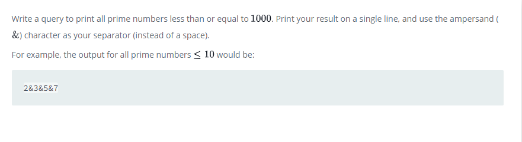

### Print Prime Numbers




#### Topic:
Write a query to print all prime numbers less than or equal to 100. Print your result on a single line, and use the ampersand (&) character as your separator (instead of a space).

For example, the output for all prime numbers ≤10 would be:

2&3&5&7


#### Language : MS SQL
```sql
create table prime_numbers (number int)
declare @nr int 
declare @divider int
declare @prime bit

select @nr = 1

while @nr < 1000
   begin 
   select @divider = @nr -1
   select @prime = 1
   while(@divider > 1)
      begin
      if @nr % @divider = 0 
         select @prime =0 
         select @divider = @divider - 1
         end
    if @prime = 1 and @nr <> 1 
          insert into prime_numbers(number) values(@nr)
      
     select @nr = @nr+1
   end
   
   select STRING_AGG (number,'&') from prime_numbers
   
```
