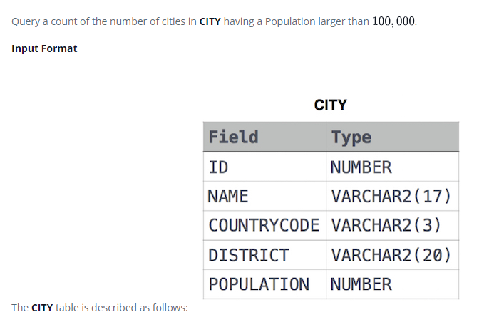

### Revising Aggregations - The Count Function




#### Topic:
Query a count of the number of cities in CITY having a Population larger than 100,000.


#### Language : MS SQL
```sql
SELECT COUNT(*) from CITY 
where POPULATION >100000
```
