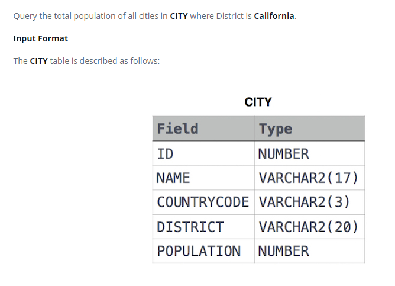

### Revising Aggregations - The Sum Function




#### Topic:
Query the total population of all cities in CITY where District is California.


#### Language : MS SQL
```sql
select sum(POPULATION) from CITY where DISTRICT ='California'
```
