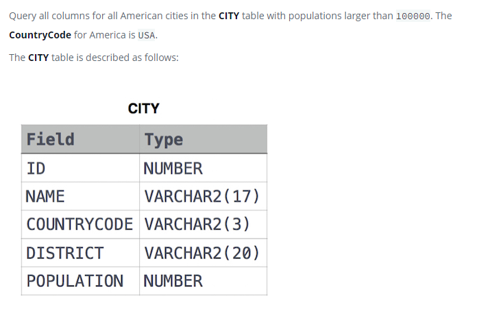

### Revising the Select Query I 




#### Topic:
Query all columns for all American cities in the CITY table with populations larger than 100000. The CountryCode for America is USA.


#### Language : MS SQL
```sql
select * from CITY where CITY.POPULATION > 100000 and CITY.COUNTRYCODE ='USA'
```
