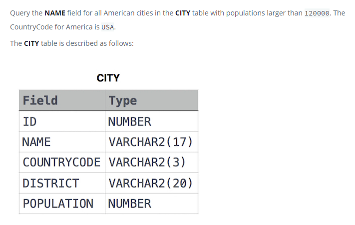

### Revising the Select Query II




#### Topic:
Query the NAME field for all American cities in the CITY table with populations larger than 120000. The CountryCode for America is USA.


#### Language : MS SQL
```sql
select NAME from CITY c where c.POPULATION > 120000 and c.COUNTRYCODE ='USA'
```
