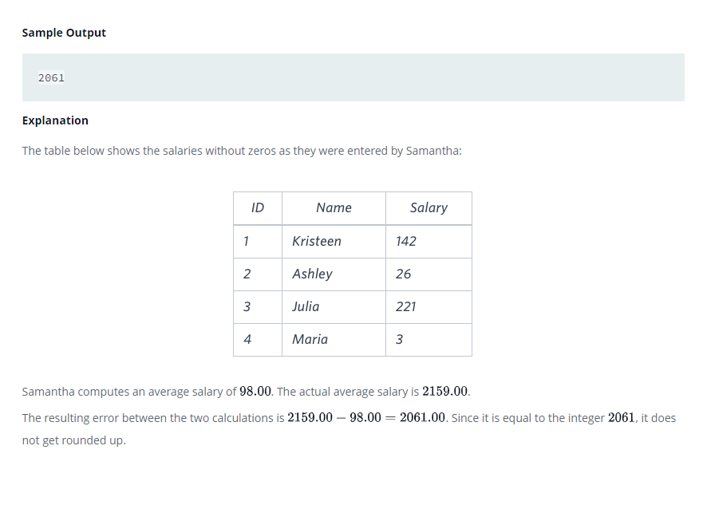

### The Blunder




#### Topic:
amantha was tasked with calculating the average monthly salaries for all employees in the EMPLOYEES table, but did not realize her keyboard’s key was broken until after completing the calculation. She wants your help finding the difference between her miscalculation (using salaries with any zeroes removed), and the actual average salary.

Write a query calculating the amount of error (i.e.: average monthly salaries), and round it up to the next integer.
Note: Salary is measured in dollars per month and its value is .
Sample Output

2061


#### Language : MS SQL
```sql
select cast(ceiling(avg(cast(salary as float)) - avg(cast(replace(salary, '0', '') as float))) as int) 
from employees
```
