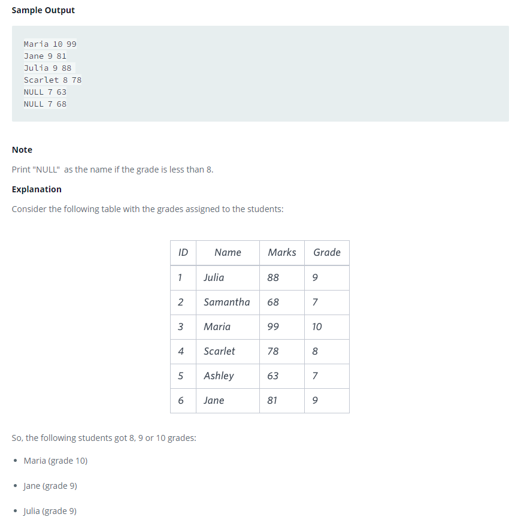

### The Report





#### Topic:
You are given two tables: Students and Grades. Students contains three columns ID, Name and Marks.
Ketty gives Eve a task to generate a report containing three columns: Name, Grade and Mark. Ketty doesn't want the NAMES of those students who received a grade lower than 8. The report must be in descending order by grade -- i.e. higher grades are entered first. If there is more than one student with the same grade (8-10) assigned to them, order those particular students by their name alphabetically. Finally, if the grade is lower than 8, use "NULL" as their name and list them by their grades in descending order. If there is more than one student with the same grade (1-7) assigned to them, order those particular students by their marks in ascending order.

Write a query to help Eve.
Sample Output

Maria 10 99
Jane 9 81
Julia 9 88 
Scarlet 8 78
NULL 7 63
NULL 7 68

Note

Print "NULL"  as the name if the grade is less than 8.

Explanation

Consider the following table with the grades assigned to the students:

So, the following students got 8, 9 or 10 grades:

*Maria (grade 10)
*Jane (grade 9)
*Julia (grade 9)
*Scarlet (grade 8)


#### Language : MS SQL
```sql
WITH take_name_grades AS (
    SELECT Name, Marks FROM students GROUP BY Name, Marks
),
affecting_grades_to_Marks AS (
    SELECT Name, Marks, Grade FROM take_name_grades, Grades
    WHERE Grade = (SELECT Grade FROM Grades WHERE take_name_grades.Marks BETWEEN Min_Mark AND Max_Mark)
),
order_results AS (
    SELECT 
        agtm.Marks, 
        agtm.Grade,
        CASE 
            WHEN agtm.Grade < 8 THEN 'NULL'
            ELSE agtm.Name 
        END AS Name
    FROM affecting_grades_to_Marks agtm
)


SELECT order_results.Name,order_results.Grade,order_results.Marks FROM order_results
order by order_results.Grade desc,order_results.Name asc,order_results.Marks asc


```
