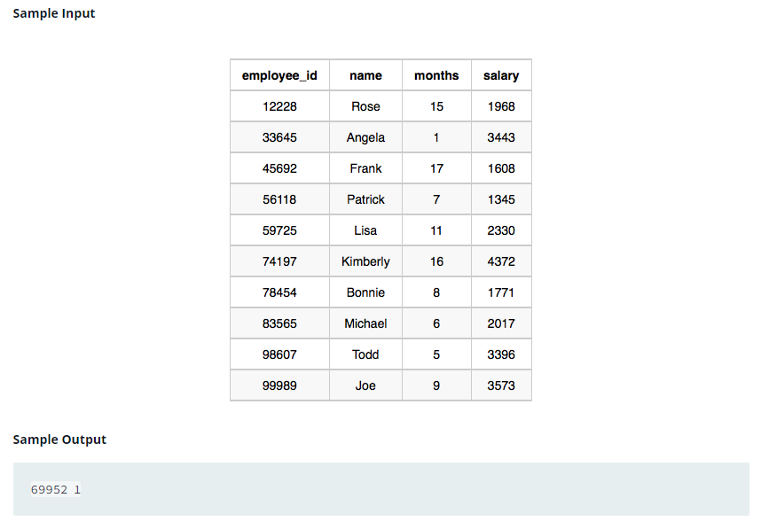

### Top Earners




#### Topic:
We define an employee’s total earnings to be their monthly salary* months worked, and the maximum total earnings to be the maximum total earnings for any employee in the Employee table. Write a query to find the maximum total earnings for all employees as well as the total number of employees who have maximum total earnings. Then print these values as space-separated integers.
where employee_id is an employee’s ID number, name is their name, months is the total number of months they’ve been working for the company, and salary is the their monthly salary.
Sample Output

69952 1


#### Language : MS SQL
```sql
select months * salary as earnings , count(employee_id) from employee 
where months * salary = (select(max(months * salary)) from employee)
group by months * salary
```
