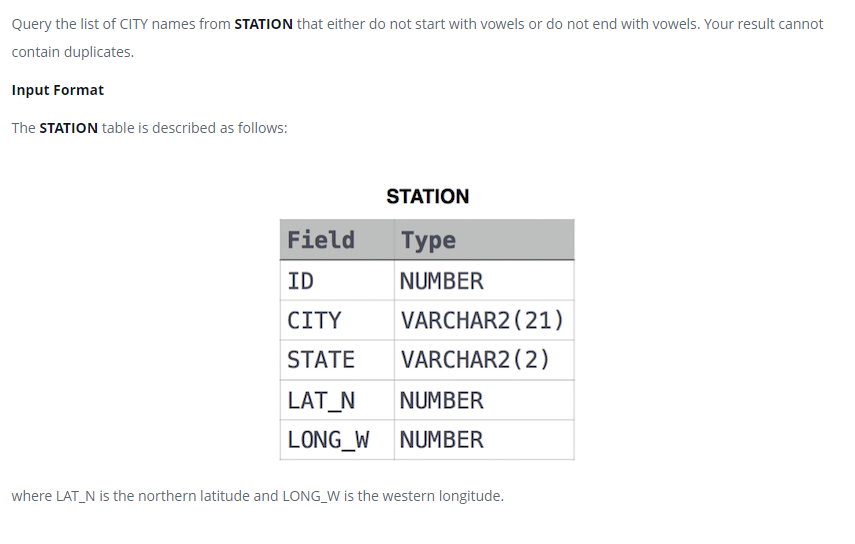

### Weather Observation Station 11




#### Topic:
Query the list of CITY names from STATION that either do not start with vowels or do not end with vowels. Your result cannot contain duplicates.
where LAT_N is the northern latitude and LONG_W is the western longitude.


#### Language : MS SQL
```sql
SELECT DISTINCT CITY
FROM STATION
WHERE (LEFT(CITY, 1) NOT IN ('A', 'E', 'I', 'O', 'U')) 
   OR (RIGHT(CITY, 1) NOT IN ('A', 'E', 'I', 'O', 'U'))
```
