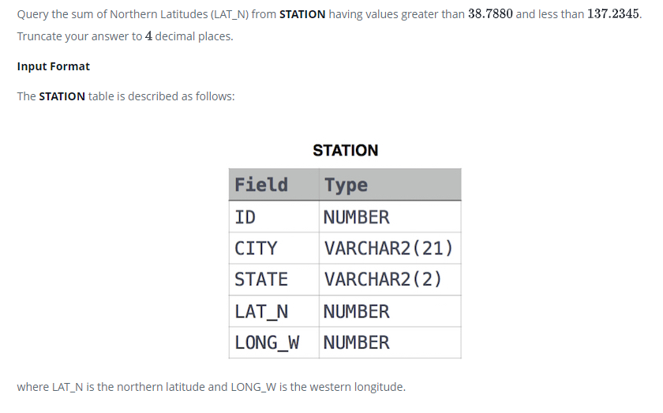

### Weather Observation Station 13 




#### Topic:
Query the sum of Northern Latitudes (LAT_N) from STATION having values greater than 38.7880 and less than 137.2345. Truncate your answer to 4 decimal places.
where LAT_N is the northern latitude and LONG_W is the western longitude.


#### Language : MS SQL
```sql
select convert(decimal(12,4) , sum(LAT_N)) from STATION where 
LAT_N > 38.7880 and LAT_N < 137.2345 
```
