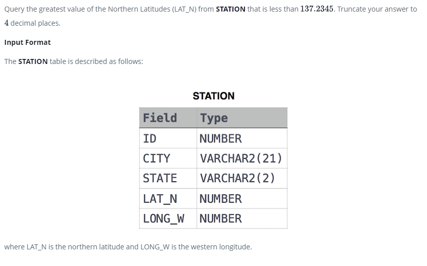

### Weather Observation Station 14




#### Topic:
Query the greatest value of the Northern Latitudes (LAT_N) from STATION that is less than 137.2345. Truncate your answer to 4 decimal places.
where LAT_N is the northern latitude and LONG_W is the western longitude.


#### Language : MS SQL
```sql
select convert(decimal(12,4), max(LAT_N)) from STATION where
LAT_N < 137.2345
```
