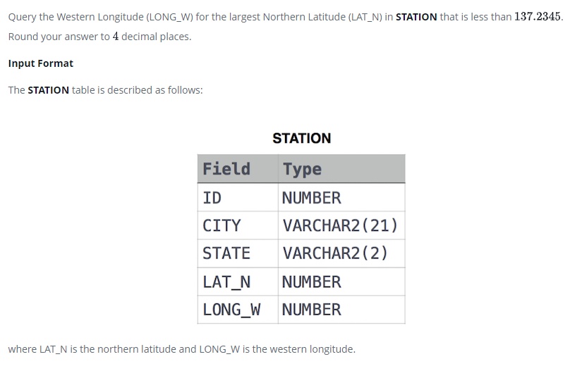

### Weather Observation Station 15 




#### Topic:
Query the Western Longitude (LONG_W) for the largest Northern Latitude (LAT_N) in STATION that is less than 137.2345. Round your answer to 4 decimal places.
where LAT_N is the northern latitude and LONG_W is the western longitude.


#### Language : MS SQL
```sql
select convert(decimal(12,4),LONG_W) from STATION 
WHERE LAT_N = (SELECT MAX(LAT_N) FROM STATION WHERE LAT_N < 137.2345)
```
