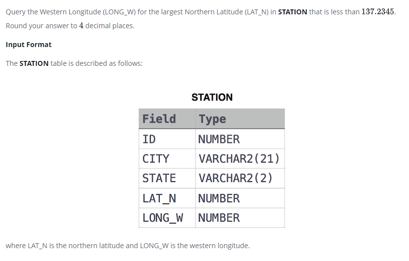

### Weather Observation Station 16




#### Topic:
Query the smallest Northern Latitude (LAT_N) from STATION that is greater than . Round your answer to decimal places.
where LAT_N is the northern latitude and LONG_W is the western longitude.


#### Language : MS SQL
```sql
select convert(decimal(12,4),min(LAT_N)) from STATION 
where LAT_N > 38.7780
```
