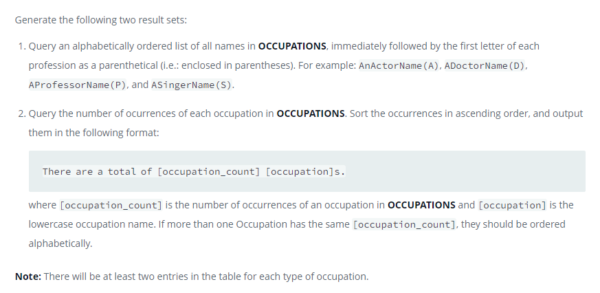

### Weather Observation Station 17




#### Topic:
Query the Western Longitude (LONG_W)where the smallest Northern Latitude (LAT_N) in STATION is greater than 38.7780. Round your answer to 4 decimal places.
where LAT_N is the northern latitude and LONG_W is the western longitude.


#### Language : MS SQL
```sql
SELECT CONVERT(decimal(12,4), LONG_W) AS low
FROM STATION
WHERE LAT_N = (SELECT MIN(LAT_N) FROM STATION WHERE LAT_N > 38.7780);
```
