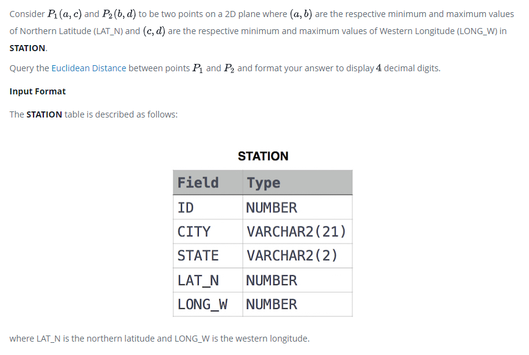

### Weather Observation Station 19




#### Topic:
Consider P1(a, c) and P2(b,d) to be two points on a 2D plane where a, c are the respective minimum and maximum values of Northern Latitude (LAT_N) and b, d are the respective minimum and maximum values of Western Longitude (LONG_W) in STATION.

Query the Euclidean Distance between points and and format your answer to display decimal digits.
where LAT_N is the northern latitude and LONG_W is the western longitude.


#### Language : MS SQL
```sql
select convert(decimal(12,4),SQRT(POWER(max(LAT_N)-min(LAT_N),2) + POWER(max(LONG_W)-min(LONG_W),2))) from
STATION
```
