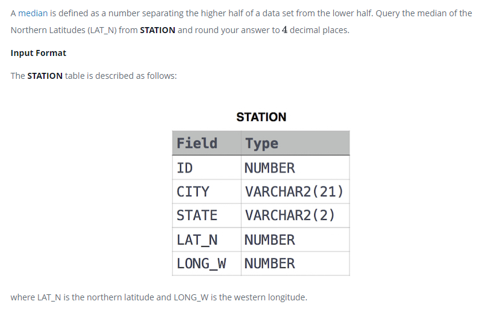

### Weather Observation Station 20




#### Topic:
A median is defined as a number separating the higher half of a data set from the lower half. Query the median of the Northern Latitudes (LAT_N) from STATION and round your answer to 4 decimal places.
where LAT_N is the northern latitude and LONG_W is the western longitude.


#### Language : MS SQL
```sql
SELECT  CAST (LAT_N  AS DECIMAL (10,4))  FROM
(SELECT  ROW_NUMBER()   OVER  (ORDER BY LAT_N ASC)  AS RANK, LAT_N FROM  STATION)  A 
WHERE RANK  =  ( SELECT  ROUND ( COUNT(*)/2,  -1)   FROM STATION)
```
