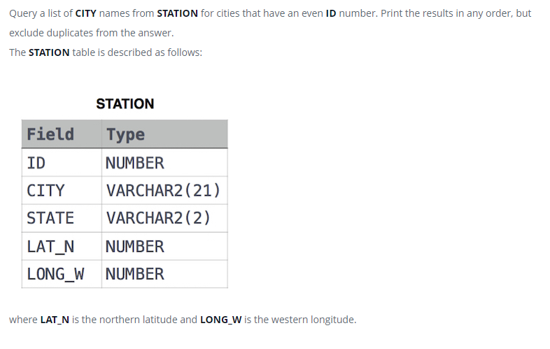

### Weather Observation Station 3




#### Topic:
Query a list of CITY names from STATION for cities that have an even ID number. Print the results in any order, but exclude duplicates from the answer.
where LAT_N is the northern latitude and LONG_W is the western longitude.


#### Language : DB2
```sql
SELECT DISTINCT CITY FROM STATION
WHERE MOD(ID,2) = 0;
```
