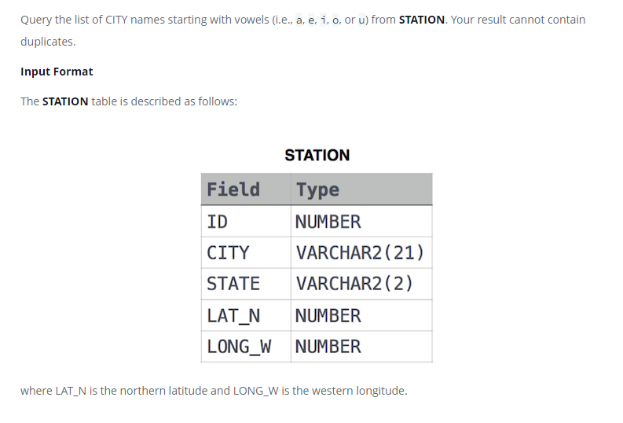

### Weather Observation Station 6




#### Topic:
Query the list of CITY names starting with vowels (i.e., a, e, i, o, or u) from STATION. Your result cannot contain duplicates.
where LAT_N is the northern latitude and LONG_W is the western longitude.


#### Language : MS SQL
```sql
select distinct CITY from STATION where CITY  LIKE 'a%' OR CITY LIKE 'e%' OR CITY LIKE 'i%' OR CITY LIKE 'o%' OR CITY LIKE 'u%'
```
