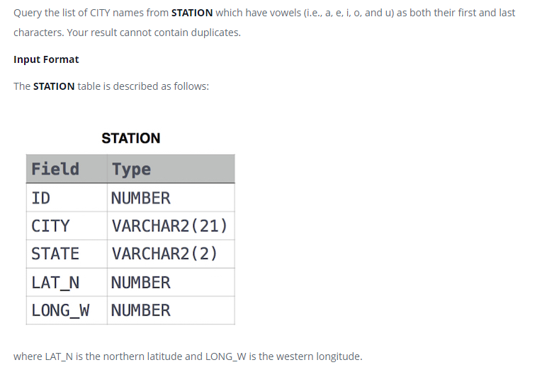

### Weather Observation Station 8




#### Topic:
Query the list of CITY names from STATION which have vowels (i.e., a, e, i, o, and u) as both their first and last characters. Your result cannot contain duplicates.
where LAT_N is the northern latitude and LONG_W is the western longitude.


#### Language : MS SQL
```sql
SELECT DISTINCT CITY
FROM STATION
WHERE (CITY LIKE '[aeiou]%[aeiou]' ESCAPE '\' OR CITY LIKE '[AEIOU]%[AEIOU]' ESCAPE '\')

```
